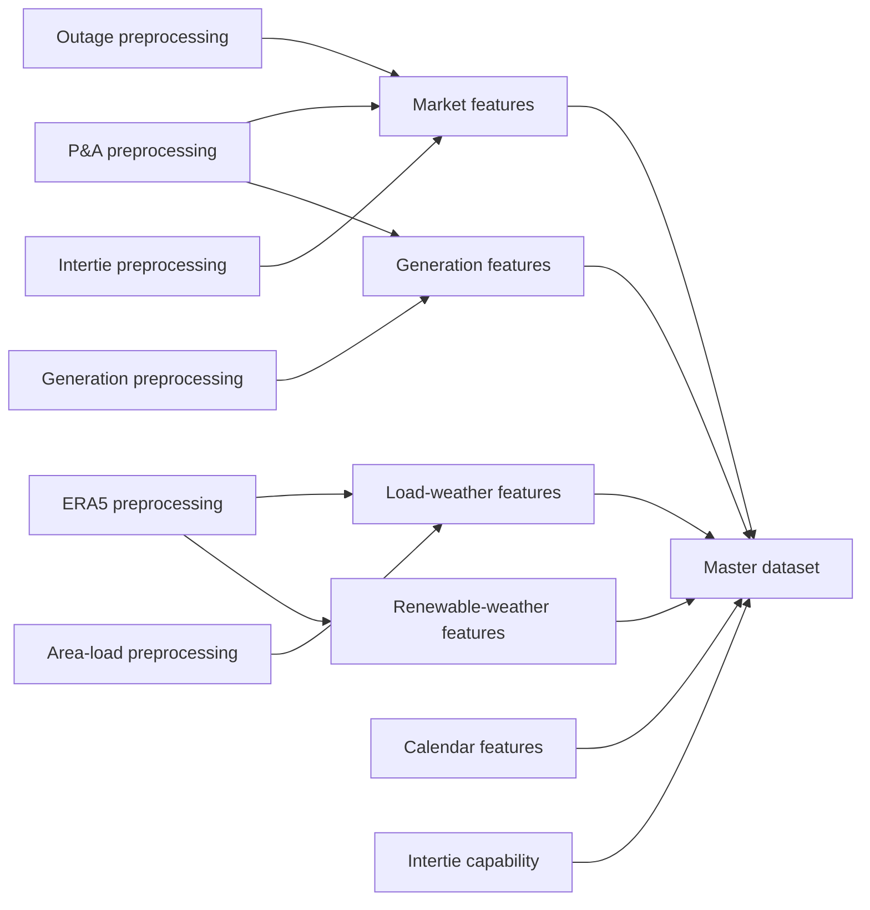

# Alberta Power Markets Project

An audited Alberta electricity-market data and forecasting research program.
The project standardizes AESO market data and ERA5 weather data, creates
model-ready features, combines approved products into one canonical
UTC-indexed master dataset, and uses a staged notebook sequence to move from
market structure and physical mechanisms toward out-of-sample forecasting.

The pipeline is designed around four principles:

- raw source files remain unchanged;
- `timestamp_utc` is the canonical hourly merge key;
- error-level audits must pass before canonical outputs are written;
- provenance manifests determine whether an existing artifact is safe to reuse.

The analytical notebooks follow the same evidence boundary as the pipeline:
historical associations are not treated as causal effects, and realized
weather, load, generation, or market outcomes are not presented as
forecast-eligible inputs unless an information-available equivalent is defined.

## Quick Start

Run these commands from the repository root.

```bash
python3 -m venv venv
source venv/bin/activate
pip install -r requirements.txt
pip install -e . --no-deps
```

Run the complete pipeline and reuse outputs whose data, code, configuration,
and artifacts are still current:

```bash
python src/run_pipeline.py
```

Force every stage to rebuild and write optional CSV copies:

```bash
python src/run_pipeline.py --overwrite --write-csv
```

Run the regression suite:

```bash
python -m unittest discover -s tests -v
```

Launch the notebooks:

```bash
jupyter lab
```

`requirements.txt` pins the validated pipeline and notebook environment.
`pyproject.toml` provides compatible package constraints and an optional
`analysis` dependency group.

## Analysis Program

The notebooks are organized by economic question so exploratory evidence,
physical mechanisms, temporal structure, and forecast evaluation remain
separate.

| Notebook | Status | Role |
| --- | --- | --- |
| `01_Market_Orientation.ipynb` | Implemented | Structural transition, normal operation, and price regimes |
| `02_Scarcity_&_System_Tightness.ipynb` | Implemented | Available margin, thermal availability, outages, imports, and scarcity events |
| `03_Fuel_Economics_&_Price_Formation.ipynb` | Implemented | Gas prices, reference fuel costs, and normal price formation |
| `04_Weather_Demand_&_Renewables.ipynb` | Implemented | Temperature-driven demand, wind and solar availability, hydro limitations, and net-load formation |
| `05_Temporal_Price_Dynamics.ipynb` | Implemented | Calendar effects, price persistence, volatility clustering, and event memory |
| `06_Market_State_Modeling.ipynb` | Implemented | Chronological market-state models, feature validation, and structural stability |
| Notebook 7 — Machine-Learning Forecast Models | Planned | Tree-based models, tuning, and calibration |
| Notebook 8 — Price and Extreme-Event Forecasting | Planned | Final forecast systems and out-of-sample evaluation |
| Notebook 9 — Market Applications | Planned | Decision-oriented and trading applications |

Notebooks 1–4 are descriptive and pre-forecasting. They identify mechanisms,
nonlinear relationships, stability, reporting limitations, and the appropriate
forecast-time equivalent of each candidate variable. Notebooks 6–8 must use
time-based validation and cannot treat same-hour realized outcomes as predictors.

## Required Local Data

The repository does not distribute source data. Before running the complete
pipeline, provide the AESO inputs expected by the preprocessing modules under
`data/raw/` and the ERA5 archive under `data/raw/weather/era5/`.

Renewable-weather features also require these locally prepared project tables:

```text
data/preprocessing/wind_projects_preprocessed.csv
data/preprocessing/solar_projects_preprocessed.csv
```

Those two tables are pipeline inputs but are not currently produced by a
registered `run_pipeline.py` stage. An optional
`data/preprocessing/load_regions.csv` can override the built-in load
region weather coordinates.

## Pipeline

`src/run_pipeline.py` executes 14 stages in dependency order:

| Order | Stage | Main inputs | Main product |
| ---: | --- | --- | --- |
| 1 | `era5` | Raw single- and pressure-level ERA5 files | Standardized monthly ERA5 NetCDF files |
| 2 | `pa` | AESO price and demand data | Hourly price, AIL, gas-price, and spark-spread table |
| 3 | `outages` | AESO outage data | Hourly outages by fuel type |
| 4 | `interties_hour_ahead` | AESO intertie and forecast data | Hourly imports, exports, and hour-ahead price forecast |
| 5 | `intertie_capability` | AESO ATC/TTC data | Hourly intertie capability |
| 6 | `generation` | AESO generation-by-fuel data | Hourly generation, availability, and capacity by fuel |
| 7 | `area_load` | Legacy area-load workbooks and the Load Chart export | Audited hourly regional load with observed 2025+ values |
| 8 | `aeso_api` | Downloaded AESO API responses | Source-specific tables plus one merge-ready hourly API dataset |
| 9 | `calendar_features` | Configured UTC range | Calendar, holiday, season, and cyclical features |
| 10 | `market_features` | P&A, outages, and interties | Price, load, outage, and intertie features |
| 11 | `generation_features` | Generation and P&A | Generation, capacity, share, and net-load features |
| 12 | `load_weather_features` | Regional load and standardized ERA5 | Load-weighted weather features |
| 13 | `renewable_weather_features` | Wind/solar projects and standardized ERA5 | Capacity-weighted renewable-weather features |
| 14 | `master` | All approved feature products | `master_hourly.parquet` |



The ERA5 downloader is deliberately outside this execution graph. The pipeline
standardizes and audits raw weather files already on disk; it does not make
network requests automatically.

### Selective execution

`--only` includes every transitive prerequisite and preserves pipeline order.
For example, this evaluates every stage required to produce the master dataset:

```bash
python src/run_pipeline.py --only master
```

Multiple requested stages are comma-separated:

```bash
python src/run_pipeline.py --only market_features,generation_features
```

Useful runner options:

| Option | Behavior |
| --- | --- |
| `--overwrite` | Rebuild selected stages even when their artifacts are current |
| `--write-csv` | Write optional CSV copies in addition to canonical Parquet outputs |
| `--quick-era5` | Skip expensive ERA5 variable and meteorological audits while retaining structural checks |
| `--skip stage1,stage2` | Explicitly omit named stages during an otherwise full run |
| `--continue-on-failure` | Continue after a failed stage instead of stopping immediately |

`--only` ignores `--skip`. Explicitly skipped stages are not evaluated for
freshness, so `--skip` should be used only when their existing products are
intentionally being accepted.

## ERA5 Acquisition and Validation

ERA5 acquisition requires CDS API credentials configured for `cdsapi`.

Download the configured range, currently January 2015 through June 2026:

```bash
python src/era5/era5_downloader.py
```

The downloader:

- downloads through temporary `.part` files;
- validates the exact hourly timeline before accepting or skipping a file;
- attempts every pressure-level request even if another request fails;
- exits unsuccessfully if any requested file remains invalid.

Validate the raw archive without downloading anything:

```bash
python src/era5/era5_download_progress.py
```

Use `--save-csv` to save the raw-download audit, or `--watch` to refresh the
validation display repeatedly.

Raw ERA5 files live under:

```text
data/raw/weather/era5/
```

Standardized monthly files are written under:

```text
data/preprocessing/era5_preprocessing/monthly_standardized/
```

## TIGGE Forecast Acquisition

`src/tigge/tigge_downloader.py` downloads historical ECMWF control forecasts
from January 2020 onward for the Alberta ERA5 domain. This present-regime
window avoids known losses in older TIGGE control/surface archives while
retaining enough history for chronological validation. It retains the 00/12 UTC forecast origins and
6–72 hour lead times, with two monthly surface files and three monthly
pressure-level files (850, 700, and 500 hPa). Existing files are skipped only
when both their GRIB structure and recorded request match.

After accepting the TIGGE licence, place `ECMWF_API_KEY` in the ignored
project-root `.env` file or configure the ECMWF Data Store API in
`~/.cdsapirc`, then preview or run the complete archive with:

```bash
tigge-download --dry-run --start-year 2020 --end-year 2020 --end-month 1
tigge-download
```

If ECMWF pressure-level archive tapes are temporarily unavailable, complete
the surface archive first and retry the pressure archive later:

```bash
tigge-download --surface-only
tigge-download --pressure-only
```

Raw files and exact-request metadata are written under
`data/raw/weather/tigge/`. Forecast origin, lead time, and valid time must all
be preserved during future preprocessing.

## AESO API Acquisition and Preprocessing

Authenticated AESO API downloads use `AESO_API_KEY` from the environment or
the ignored project-root `.env` file. The core research download commands and
timing limitations are documented in `src/aeso_api/README.md`.

After downloading the selected API sources, normalize them with:

```bash
aeso-api-preprocess
```

The command writes source-specific Parquet datasets and
`aeso_api_dataset_hourly.parquet` under `data/preprocessing/aeso_api/`, with
quality, overlap, and forecast-eligibility registers under
`data/audits/preprocessing/aeso_api/`. The hourly API dataset is merged into
the canonical master with `aeso_`-prefixed columns. Duplicate actual-load and
pool-price fields are retained only in the source-specific reconciliation
tables and are excluded from the merge-ready dataset. Static asset and pool-
participant snapshots also remain reference tables rather than being repeated
across every master hour.

## Repository Layout

```text
.
├── data/
│   ├── raw/                         # Original AESO, ERA5, and project inputs
│   ├── preprocessing/               # Clean source-level hourly datasets
│   │   ├── aeso_api/                # Normalized AESO API products
│   │   └── era5_preprocessing/      # Standardized monthly ERA5 grids
│   ├── feature_engineering/         # Model-ready feature datasets
│   ├── master/                      # Canonical merged analytical dataset
│   └── audits/
│       ├── preprocessing/           # Source and ERA5 audit evidence
│       ├── feature_engineering/     # Feature audit evidence and mappings
│       └── master/                  # Master merge and feature summaries
├── notebooks/                       # Exploratory and report-style analysis
├── src/
│   ├── era5/                        # ERA5 download and raw validation tools
│   ├── preprocessing/               # Raw-to-clean stages and master merge
│   │   └── shared.py                # Duplicate, audit, and tabular I/O contracts
│   ├── feature_engineering/         # Hourly feature builders
│   │   └── shared.py                # Feature, weather, timing, and I/O helpers
│   ├── config.py                    # Canonical paths, coverage, and constants
│   ├── pipeline_shared.py           # Shared provenance and freshness contract
│   └── run_pipeline.py              # Dependency-aware pipeline runner
├── tests/                            # Regression and contract tests
├── pyproject.toml                    # Package metadata and compatible dependencies
├── requirements.txt                  # Exact validated dependency versions
└── README.md
```

The `data/` directory is intentionally excluded from Git. Raw and generated
datasets must be obtained or recreated locally.

## Canonical Outputs

Preprocessing products:

```text
data/preprocessing/pa_hourly_preprocessed.parquet
data/preprocessing/outages_preprocessed.parquet
data/preprocessing/interties_hour_ahead.parquet
data/preprocessing/intertie_capability.parquet
data/preprocessing/generation_by_fuel.parquet
data/preprocessing/regional_load_preprocessed.parquet
```

Feature products:

```text
data/feature_engineering/calendar/calendar_features_hourly.parquet
data/feature_engineering/market/market_features_hourly.parquet
data/feature_engineering/generation/generation_features_hourly.parquet
data/feature_engineering/weather/load_weather_features_hourly.parquet
data/feature_engineering/weather/renewable_weather_features_hourly.parquet
```

Final analytical product:

```text
data/master/master_hourly.parquet
```

Parquet is canonical. CSV representations are intended for inspection or
interchange and can be requested with `--write-csv` where supported.

## Audits and Provenance

Every stage produces structured audit evidence. Error-level failures prevent
canonical outputs from being approved; warnings document unusual but accepted
source characteristics.

Provenance is implemented in `src/pipeline_shared.py`. Each approved artifact
has a neighboring `.manifest.json` file that records:

- source-file identity;
- hashes of the governing code and configuration;
- stage configuration;
- identity of the generated artifact itself.

An output is reused only when both its pipeline manifest and artifact identity
match. Audit tables and optional CSV products participate in the same freshness
contract rather than being treated as disposable logs.

The two domain-specific shared modules build on this foundation:

- `src/preprocessing/shared.py` provides duplicate resolution, standardized
  audit construction, canonical tabular writing, and preprocessing code paths;
- `src/feature_engineering/shared.py` provides hourly validation, source
  merging, lags, prior-only rolling statistics, weather/spatial utilities,
  feature timing, summaries, and feature-output writing.

The master builder uses `preprocessing/shared.py` because it creates and audits
a canonical tabular product; it does not engineer new predictive variables.

## Configuration and Time Conventions

All canonical paths and the common pipeline horizon are defined in
`src/config.py`. `PROJECT_ROOT` is derived from that file's location, so the
repository can be moved without editing an absolute path.

Important conventions:

- `timestamp_utc` is the one-row-per-hour merge key;
- source-specific timestamp conventions are normalized during preprocessing;
- Alberta-local calendar fields use `America/Edmonton` and therefore represent
  daylight-saving transitions correctly;
- the configured calendar and ERA5 horizon is January 2015 through June 2026.

## Regional-Load Source Contract

The canonical load-weather input is
`data/preprocessing/regional_load_preprocessed.parquet`. The pipeline preserves
the legacy six-region series through December 2024, then uses observed `Meter
Load` from `Load Chart_Full Data_data.csv` beginning January 2025. This removes
the former frozen-distribution extension without silently rewriting historical
notebook inputs.

The new source's regional `Actual Load`, `BTF Load`, and `Meter Load` fields are
retained as parallel diagnostics. Differences against the legacy source are
recorded in `data/audits/preprocessing/regional_load_overlap_audit.csv`.
The 42 planning-area fields remain a separate historical product; current
load-weather feature engineering does not consume them.

## Testing

The standard test command is:

```bash
python -m unittest discover -s tests -v
```

The suite covers:

- timestamp, lag, change, and prior-only rolling-feature contracts;
- feature timing and weather-schema requirements;
- exact versus conflicting duplicate handling;
- preprocessing paths and transformations;
- ERA5 grid, timeline, acquisition, and progress validation;
- artifact and audit provenance invalidation;
- master-column overlap reconciliation;
- pipeline dependency expansion and stage ordering;
- the intentional frozen area-load extension.

Tests validate code behavior and do not replace the audits performed against the
complete local datasets.

## Installing as a Package

`pyproject.toml` defines the package, compatible dependencies, an optional
analysis environment, and command-line entry points. For the exact
validated environment, install the pinned requirements before installing the
project in editable mode:

```bash
pip install -r requirements.txt
pip install -e . --no-deps
```

Alternatively, install compatible pipeline and notebook dependencies directly
from the package metadata:

```bash
pip install -e ".[analysis]"
```

The following commands then become available:

```bash
alberta-power-pipeline --overwrite --write-csv
era5-download
era5-progress
tigge-download
aeso-download --help
aeso-api-preprocess
regional-load-preprocess
```

Direct `python src/...` commands remain fully supported.
