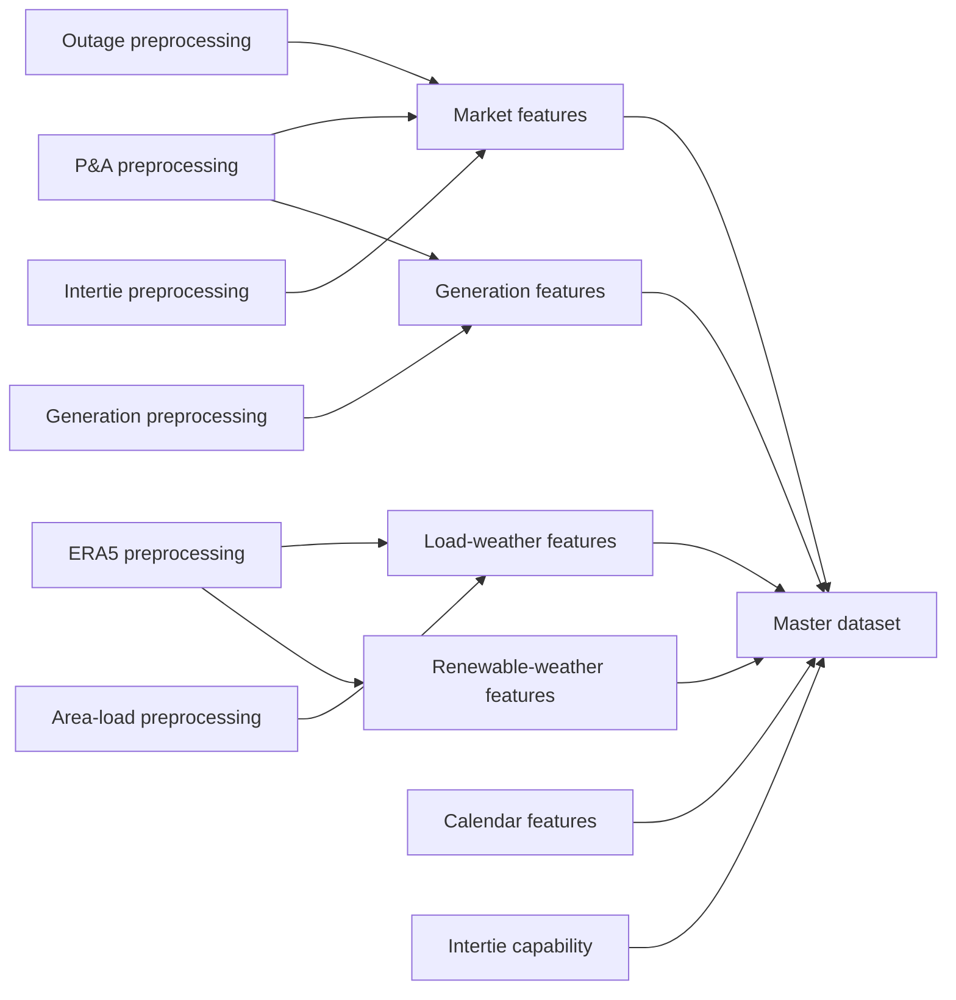

# Alberta Power Markets Project

An audited hourly data pipeline for Alberta electricity-market analysis. The
project standardizes AESO market data and ERA5 weather data, creates
model-ready features, and combines the approved products into one canonical
UTC-indexed master dataset.

The pipeline is designed around four principles:

- raw source files remain unchanged;
- `timestamp_utc` is the canonical hourly merge key;
- error-level audits must pass before canonical outputs are written;
- provenance manifests determine whether an existing artifact is safe to reuse.

## Quick Start

Run these commands from the repository root.

```bash
python3 -m venv .venv
source .venv/bin/activate
pip install -r requirements.txt
```

Run the complete pipeline and reuse outputs whose data, code, configuration,
and artifacts are still current:

```bash
python src/run_pipeline.py
```

Force every stage to rebuild and write optional CSV copies:

```bash
python src/run_pipeline.py --overwrite --write-csv
```

Run the regression suite:

```bash
python -m unittest discover -s tests -v
```

The validated local environment can also run these commands without activating
the virtual environment:

```bash
./venv/bin/python src/run_pipeline.py --overwrite --write-csv
./venv/bin/python -m unittest discover -s tests -v
```

## Required Local Data

The repository does not distribute source data. Before running the complete
pipeline, provide the AESO inputs expected by the preprocessing modules under
`data/raw/` and the ERA5 archive under `data/raw/weather/era5/`.

Renewable-weather features also require these locally prepared project tables:

```text
data/processed/preprocessing/wind_projects_preprocessed.csv
data/processed/preprocessing/solar_projects_preprocessed.csv
```

Those two tables are pipeline inputs but are not currently produced by a
registered `run_pipeline.py` stage. An optional
`data/processed/preprocessing/load_regions.csv` can override the built-in load
region weather coordinates.

## Pipeline

`src/run_pipeline.py` executes 13 stages in dependency order:

| Order | Stage | Main inputs | Main product |
| ---: | --- | --- | --- |
| 1 | `era5` | Raw single- and pressure-level ERA5 files | Standardized monthly ERA5 NetCDF files |
| 2 | `pa` | AESO price and demand data | Hourly price, AIL, gas-price, and spark-spread table |
| 3 | `outages` | AESO outage data | Hourly outages by fuel type |
| 4 | `interties_hour_ahead` | AESO intertie and forecast data | Hourly imports, exports, and hour-ahead price forecast |
| 5 | `intertie_capability` | AESO ATC/TTC data | Hourly intertie capability |
| 6 | `generation` | AESO generation-by-fuel data | Hourly generation, availability, and capacity by fuel |
| 7 | `area_load` | AESO area-load workbooks | Hourly area and regional load |
| 8 | `calendar_features` | Configured UTC range | Calendar, holiday, season, and cyclical features |
| 9 | `market_features` | P&A, outages, and interties | Price, load, outage, and intertie features |
| 10 | `generation_features` | Generation and P&A | Generation, capacity, share, and net-load features |
| 11 | `load_weather_features` | Area load and standardized ERA5 | Load-weighted weather features |
| 12 | `renewable_weather_features` | Wind/solar projects and standardized ERA5 | Capacity-weighted renewable-weather features |
| 13 | `master` | All approved feature products | `master_hourly.parquet` |



The ERA5 downloader is deliberately outside this execution graph. The pipeline
standardizes and audits raw weather files already on disk; it does not make
network requests automatically.

### Selective execution

`--only` includes every transitive prerequisite and preserves pipeline order.
For example, this evaluates every stage required to produce the master dataset:

```bash
python src/run_pipeline.py --only master
```

Multiple requested stages are comma-separated:

```bash
python src/run_pipeline.py --only market_features,generation_features
```

Useful runner options:

| Option | Behavior |
| --- | --- |
| `--overwrite` | Rebuild selected stages even when their artifacts are current |
| `--write-csv` | Write optional CSV copies in addition to canonical Parquet outputs |
| `--quick-era5` | Skip expensive ERA5 variable and meteorological audits while retaining structural checks |
| `--skip stage1,stage2` | Explicitly omit named stages during an otherwise full run |
| `--continue-on-failure` | Continue after a failed stage instead of stopping immediately |

`--only` ignores `--skip`. Explicitly skipped stages are not evaluated for
freshness, so `--skip` should be used only when their existing products are
intentionally being accepted.

## ERA5 Acquisition and Validation

ERA5 acquisition requires CDS API credentials configured for `cdsapi`.

Download the configured range, currently January 2015 through June 2026:

```bash
python src/era5/era5_downloader.py
```

The downloader:

- downloads through temporary `.part` files;
- validates the exact hourly timeline before accepting or skipping a file;
- attempts every pressure-level request even if another request fails;
- exits unsuccessfully if any requested file remains invalid.

Validate the raw archive without downloading anything:

```bash
python src/era5/era5_download_progress.py
```

Use `--save-csv` to save the raw-download audit, or `--watch` to refresh the
validation display repeatedly.

Raw ERA5 files live under:

```text
data/raw/weather/era5/
```

Standardized monthly files are written under:

```text
data/processed/preprocessing/weather/era5/monthly_standardized/
```

## Repository Layout

```text
.
├── data/
│   ├── raw/                         # Original AESO, ERA5, and project inputs
│   ├── processed/
│   │   ├── preprocessing/           # Clean source-level hourly datasets
│   │   ├── feature_engineering/     # Model-ready feature datasets
│   │   └── master/                  # Canonical merged analytical dataset
│   └── audits/
│       ├── preprocessing/           # Source and ERA5 audit evidence
│       ├── feature_engineering/     # Feature audit evidence and mappings
│       └── master/                  # Master merge and feature summaries
├── notebooks/                       # Exploratory and report-style analysis
├── src/
│   ├── era5/                        # ERA5 download and raw validation tools
│   ├── preprocessing/               # Raw-to-clean stages and master merge
│   │   └── shared.py                # Duplicate, audit, and tabular I/O contracts
│   ├── feature_engineering/         # Hourly feature builders
│   │   └── shared.py                # Feature, weather, timing, and I/O helpers
│   ├── config.py                    # Canonical paths, coverage, and constants
│   ├── pipeline_shared.py           # Shared provenance and freshness contract
│   └── run_pipeline.py              # Dependency-aware pipeline runner
├── tests/                            # Regression and contract tests
├── pyproject.toml                    # Package metadata and compatible dependencies
├── requirements.txt                  # Exact validated dependency versions
└── README.md
```

The `data/` directory is intentionally excluded from Git. Raw and generated
datasets must be obtained or recreated locally.

## Canonical Outputs

Preprocessing products:

```text
data/processed/preprocessing/pa_hourly_preprocessed.parquet
data/processed/preprocessing/outages_preprocessed.parquet
data/processed/preprocessing/interties_hour_ahead.parquet
data/processed/preprocessing/intertie_capability.parquet
data/processed/preprocessing/generation_by_fuel.parquet
data/processed/preprocessing/area_load_preprocessed.parquet
```

Feature products:

```text
data/processed/feature_engineering/calendar/calendar_features_hourly.parquet
data/processed/feature_engineering/market/market_features_hourly.parquet
data/processed/feature_engineering/generation/generation_features_hourly.parquet
data/processed/feature_engineering/weather/load_weather_features_hourly.parquet
data/processed/feature_engineering/weather/renewable_weather_features_hourly.parquet
```

Final analytical product:

```text
data/processed/master/master_hourly.parquet
```

Parquet is canonical. CSV representations are intended for inspection or
interchange and can be requested with `--write-csv` where supported.

## Audits and Provenance

Every stage produces structured audit evidence. Error-level failures prevent
canonical outputs from being approved; warnings document unusual but accepted
source characteristics.

Provenance is implemented in `src/pipeline_shared.py`. Each approved artifact
has a neighboring `.manifest.json` file that records:

- source-file identity;
- hashes of the governing code and configuration;
- stage configuration;
- identity of the generated artifact itself.

An output is reused only when both its pipeline manifest and artifact identity
match. Audit tables and optional CSV products participate in the same freshness
contract rather than being treated as disposable logs.

The two domain-specific shared modules build on this foundation:

- `src/preprocessing/shared.py` provides duplicate resolution, standardized
  audit construction, canonical tabular writing, and preprocessing code paths;
- `src/feature_engineering/shared.py` provides hourly validation, source
  merging, lags, prior-only rolling statistics, weather/spatial utilities,
  feature timing, summaries, and feature-output writing.

The master builder uses `preprocessing/shared.py` because it creates and audits
a canonical tabular product; it does not engineer new predictive variables.

## Configuration and Time Conventions

All canonical paths and the common pipeline horizon are defined in
`src/config.py`. `PROJECT_ROOT` is derived from that file's location, so the
repository can be moved without editing an absolute path.

Important conventions:

- `timestamp_utc` is the one-row-per-hour merge key;
- source-specific timestamp conventions are normalized during preprocessing;
- Alberta-local calendar fields use `America/Edmonton` and therefore represent
  daylight-saving transitions correctly;
- the configured calendar and ERA5 horizon is January 2015 through June 2026.

## Area-Load Assumption

Observed area-load distribution data ends in 2024. To support downstream 2025
analysis, the pipeline intentionally extends the final 2024 distribution
through the end of 2025.

Extended rows are explicitly identified by:

- `area_load_imputed = 1`;
- `area_load_frozen = 1`.

This is an explicit modeling assumption, not observed 2025 distribution data.
The implementation and regression test remain in place so the assumption cannot
silently change.

## Testing

The standard test command is:

```bash
python -m unittest discover -s tests -v
```

The suite covers:

- timestamp, lag, change, and prior-only rolling-feature contracts;
- feature timing and weather-schema requirements;
- exact versus conflicting duplicate handling;
- preprocessing paths and transformations;
- ERA5 grid, timeline, acquisition, and progress validation;
- artifact and audit provenance invalidation;
- master-column overlap reconciliation;
- pipeline dependency expansion and stage ordering;
- the intentional frozen area-load extension.

Tests validate code behavior and do not replace the audits performed against the
complete local datasets.

## Installing as a Package

`pyproject.toml` defines the package, compatible dependencies, and three command
line entry points. Install it in editable mode after installing the validated
requirements:

```bash
pip install -r requirements.txt
pip install -e . --no-deps
```

The following commands then become available:

```bash
alberta-power-pipeline --overwrite --write-csv
era5-download
era5-progress
```

Direct `python src/...` commands remain fully supported.
